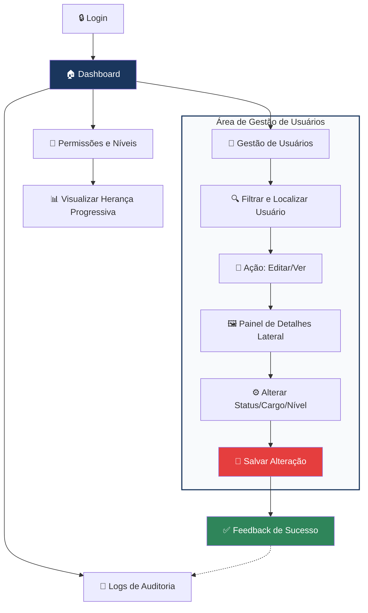

# 🛡️ NexAcess - Painel Administrativo de Usuários e Permissões

O **NexAcess** é um wireframe de média fidelidade projetado para uma plataforma corporativa de gestão de identidades e acessos (IAM). O foco principal é oferecer a administradores de sistemas uma interface robusta, clara e à prova de erros para o gerenciamento de permissões críticas.

---

## 🎯 Objetivo do Projeto

Este projeto foi desenvolvido como uma atividade acadêmica para o curso de ADS, com o intuito de resolver o desafio de gerenciar grandes volumes de usuários e permissões complexas em um ambiente de alta responsabilidade.

### 👤 Perfil do Usuário
*   **Persona:** Administrador(a) de sistemas experiente.
*   **Necessidades:** Rapidez na tomada de decisão, visibilidade total de logs e segurança em ações sensíveis.
*   **Contexto:** Baixa tolerância a erros operacionais e pouco tempo disponível.

---

## ✨ Funcionalidades Principais

| Recurso | Descrição |
| :--- | :--- |
| **🔍 Filtros Avançados** | Localização rápida por Departamento, Cargo, Nível de Acesso e Status. |
| **🔐 Gestão de Permissões** | Alteração de níveis (Admin, Editor, Visualizador) com sistema de herança. |
| **📜 Logs de Auditoria** | Histórico detalhado com Data/Hora, Ação, Recurso e Endereço IP para conformidade. |
| **📊 Dashboard Estratégico** | Visão geral de usuários ativos, tentativas de login e mapa de calor de conexões. |
| **🛡️ Segurança Reforçada** | Implementação visual de 2FA (Autenticação de dois fatores) e modais de confirmação. |

---

## 🗺️ Fluxo de Navegação e Operação

O diagrama abaixo detalha a arquitetura do sistema, enfatizando que toda a manipulação de dados sensíveis e níveis de acesso ocorre de forma centralizada dentro do módulo de **Gestão de Usuários**, conforme os requisitos de eficiência operacional.

---

## 🚀 Diferenciais de UX (User Experience)

Para atender ao perfil de "baixa tolerância a erros", foram aplicadas as seguintes estratégias:

1.  **Diagrama de Herança Progressiva:** (Pág. 38) Uma visualização clara de como as permissões fluem do nível base até o administrativo, evitando confusão hierárquica.
2.  **Prevenção de Erros Críticos:** (Pág. 32) A alteração de status ou nível exige um "Motivo da Alteração" obrigatório, garantindo que ações sensíveis sejam documentadas e pensadas.
3.  **Feedback Instantâneo:** Modais de "Alteração salva com sucesso" confirmam o sucesso da operação, reduzindo a ansiedade do usuário.
4.  **Hierarquia Visual:** Uso de cores distintas para status (Verde para Ativo, Vermelho para Suspenso/Inativo) para leitura rápida (Scanning).

---

## 📂 Estrutura do Protótipo

O wireframe cobre o fluxo completo da aplicação:
*   **Login:** Acesso seguro com integrações sociais.
*   **Dashboard:** Monitoramento global da plataforma.
*   **Lista de Usuários:** Tabela densa de dados com ações rápidas de edição.
*   **Detalhes do Usuário:** Visão 360º de dados pessoais e histórico de ações recentes.
*   **Logs:** Transparência total sobre quem alterou o quê e quando.

---

## 🛠️ Ferramentas Utilizadas

*   **Design de Interface:** Figma
*   **Documentação:** Markdown
*   **Planejamento:** Wireframing de média fidelidade

---

## 🔗 Link do Protótipo

Teste o fluxo navegável e interativo diretamente no Figma clicando no link abaixo:

👉 **[CLIQUE AQUI PARA ACESSAR O PROTÓTIPO NO FIGMA](https://www.figma.com/proto/TyFEaBJfGkTeESz74qAf7r/Sem-título?node-id=5-4&starting-point-node-id=5%3A4)**

---

## 👥 Autoria

Desenvolvido por:
- **Ector Carvalho** - Estudante de Análise e Desenvolvimento de Sistemas (2º Semestre).
- **Rhuan Ciacco** - Estudante de Análise e Desenvolvimento de Sistemas (2º Semestre).
- **Talisom Santos** - Estudante de Análise e Desenvolvimento de Sistemas (2º Semestre).

---

> "Interface é como uma piada. Se você tiver que explicá-la, não é tão boa assim."
